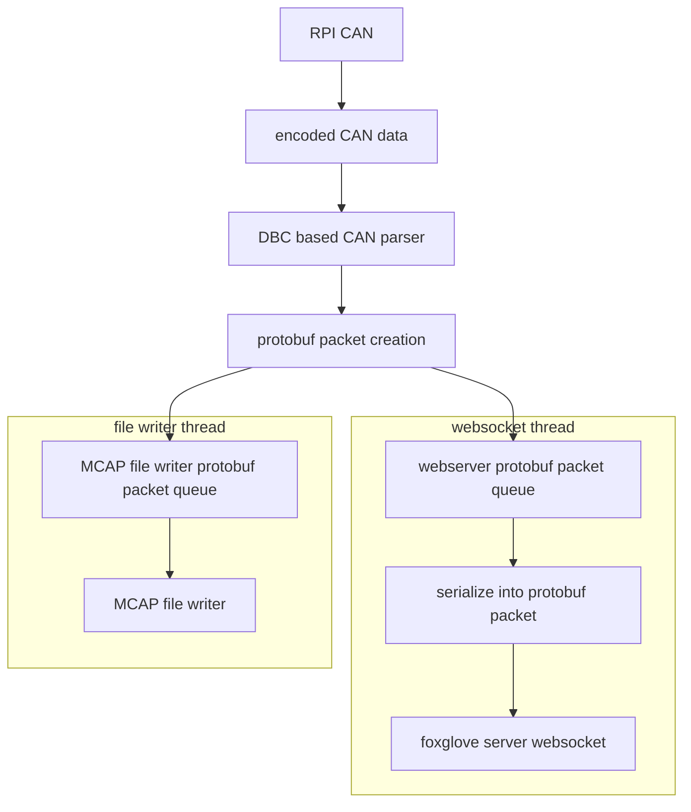

usage: 

TODO:
- [ ] actually get current data from car into protobuf encoded CAN messages and send them from current TCU / SAB

- [ ] get the raspberry pi listening to CAN messages

- [ ] adjust the foxglove server code host script to make it listen to CAN messages and switch between topics that it is sending based on the CAN IDs

- [ ] write the data storage script for saving the received CAN messages locally in the mcap 
    - [ ]  make service script that creates an instance of the mcap writer and the foxglove websocket

- [ ] the deserialization task for unpacking received data.

- [ ] come up with a good way of associating the dbc file with the protobuf file

    - I want each CAN ID to have its own protobuf message. perhaps in the protobuf message I will also include the CAN ID as a fixed part of the protobuf message in the creation of the proto file.
       
    - I know that I will be using cantools to create the DBC file so I might as well extend that creation script to create the proto at the same time. Additionally, I know that I will be using tim's auto-magic nix-proto for creation of the python auto-gen code.

## automation goals
- [ ] dbc and proto file generation using CI
- [ ] proto python lib using CI and the proto file that was generated from CI (using tim's nix flake)
- [ ] binary proto schema generation from the generated proto file using an addition to tim's nix flake
- [ ] CI generated platformio c/c++ library from DBC

## automation requirements:
- [ ] nix flake packaging of all non existing packaged 
- [ ] creation of at least 3 CI jobs

## high level overview
input: 
- protobuf stream (will be from CAN, this prototype will be from a port)

output: 
- saved files at time steps
- encoded websocket stream of data
- desired behavior for the data flow:
    - on hardware receive in the data_handler script data gets pushed into a container triggers both the webserver and the data writer to use that data
    - once both the data writer and the foxglove websocket have finished processing the data delete the data from the container
- a desired workflow is that it all we need to do to add a new input that we will be seeing over the wire is to add a .proto to a specific folder. No code changes should be required.

### notes:
- filter journalctl based on service: `journalctl -u nginx.service`
