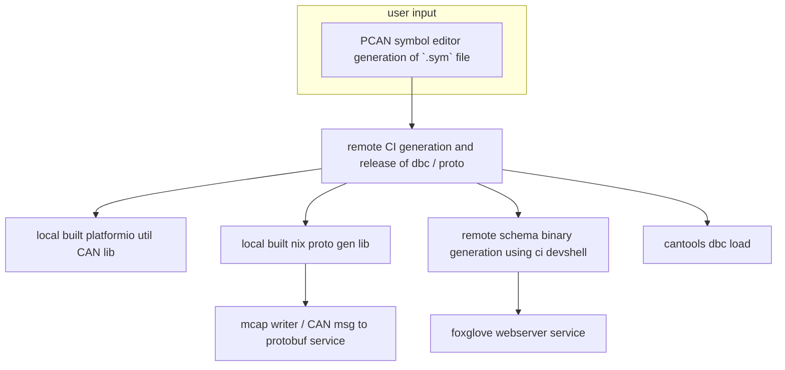

# Base person usage:
1. Download foxglove studio at https://github.com/foxglove/studio/releases 
2. Connect to the Pi's network 
3. Open foxglove studio 
4. Open a connection to the Pi's IP on port 8765 
5. Look at data

# dev usage: 

to get into a dev environment locally (on linux):
1. install nix:

```bash
sh <(curl -L https://nixos.org/nix/install) --daemon
```

2. enable flakes:
    - Add the following to `~/.config/nix/nix.conf` or `/etc/nix/nix.conf`:
    ```
    experimental-features = nix-command flakes
    ```

3. run `nix develop` to enter dev shell

4. run `runner.py` for the local usb to CAN listener on host machine


usage notes:
- update to newest hytech CAN description:

`nix flake lock --update-input ht_can_pkg_flake`

by default, it uses a fixed version of the hytech CAN library and it must be manually updated. downstream usage of this can update this too via specifying it in the flake input as well if need be.
TODO:
- [x] write test script for creating a cantools constructed hytech CAN msg and sends it over a virtual CAN line
- [x] make the deserialization task for unpacking received data from CAN in the data acq service script.
- [x] create nixos module for py_data_acq
- [x] make ability to start / stop / control in general the data recording via grpc calls for the mcap writer task (pending nix-proto adjustment)
- [x] make user script / interface for the grpc calls for ease of interaction with the service (pending nix-proto adjustment)

- [x] actually get current data from car into protobuf encoded CAN messages in an integration test
- [x] get nix-proto working with dbc input from url for creation of python lib
- [x] get py_data_acq working in dev shell with nix-proto generated python lib for proto msg packing
- [x] make service script that creates an instance of the mcap writer and the foxglove websocket
- [x] come up with a good way of associating the dbc file with the protobuf file


## automation goals
- [x] dbc and proto file generation using CI
- [x] binary schema generation from proto file in CI
    - I am thinking for this we can just use protoc in a dev shell similar to how I did the proto and dbc creation with the script
- [x] platformio c/c++ library from DBC by making a platformio script (python / platformio)
- [x] integrate user created pcan SYM file into automated creation of dbc and proto file
    - [PCAN editor](https://www.peak-system.com/PCAN-Symbol-Editor-6.416.0.html?&L=1) for creating the human readable SYM files
    - the cantools library can already use this as a description of the CAN network so the dbc file creation will be simplified a lot more



## automation requirements:
- [x] nix flake packaging of all non existing packages
- [x] nixification of data_acq
    - [x] package foxglove mcap support / other foxglove python stuff for nix
    - [x] creation of executable for setup.py so that it is something that can be run in the flake
- [x] nixification of the dbc and proto file generator module
    - [x] creation of CI job that runs the dbc and proto generation script and uploads the file to the release
    - im thinking that the dbc file gets stored in the repo for this as well (?)
        - nop, needs to be in an action artifact storage
            - actually the dbc, proto and schema binary will be in the release

## high level overview
input: 
- protobuf stream (will be from CAN, this prototype will be from a port)

output: 
- saved files at time steps
- encoded websocket stream of data
- desired behavior for the data flow:
    - on hardware receive in the data_handler script data gets pushed into a container triggers both the webserver and the data writer to use that data
    - once both the data writer and the foxglove websocket have finished processing the data delete the data from the container
- a desired workflow is that it all we need to do to add a new input that we will be seeing over the wire is to add a .proto to a specific folder. No code changes should be required.


### notes:
- filter journalctl based on service: `journalctl -u nginx.service`

- it looks like the PCAN sym files along with the editor is a good format and tool for creation of the CAN network

- I will simply match the CAN frame id name to the message name, and match each signal name (spaces into underscores) to the field name in the proto. The protobuf message will be packed with the parsed and converted data from cantools.

    - I want each CAN ID to have its own protobuf message. perhaps in the protobuf message I will also include the CAN ID as a fixed part of the protobuf message in the creation of the proto file.
    
    - I know that I will be using cantools to create the DBC file so I might as well extend that creation script to create the proto at the same time. Additionally, I know that I will be using tim's auto-magic nix-proto for creation of the python auto-gen code.


kvaser u100 pinout:

